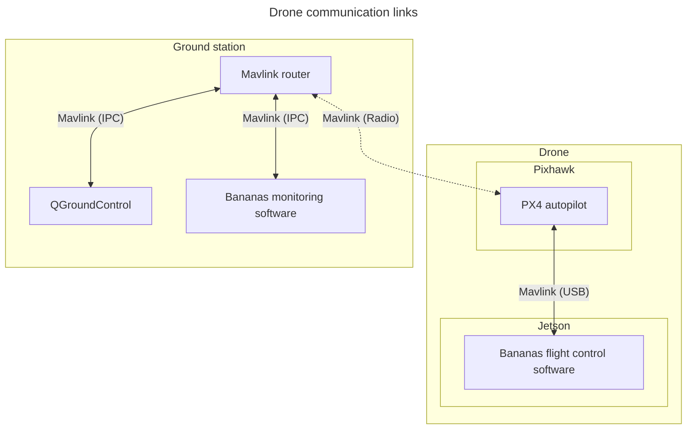
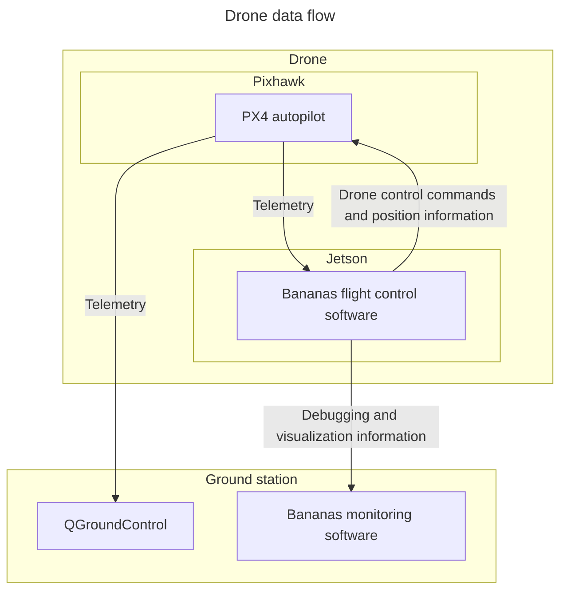
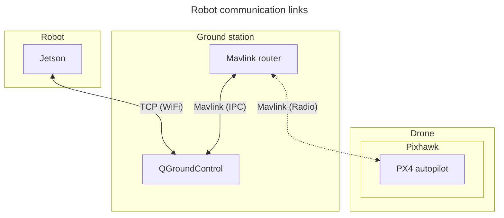

# Planned system architecture

## Drone (Henrik, Pekko, Väinö)

The drone's task is to locate the robot and the boxes using a camera, relocating
itself to locations where it can see them best. The drone will have two
computers onboard: a Pixhawk running the PX4 autopilot and a Jetson Orin Nano
running our control software and reading camera input. In addition to
controlling the drone, the Jetson gives the autopilot camera-based position
information to correct its knowledge on the drone's position.

### Communication

At the time of writing, it seems like we won't be able to fit a WiFi antenna to
the Jetson carried by our drone. Hence, all communication to and from the Jetson
needs to go through the radio connected to the Pixhawk autopilot module.

## Robot

The robots task is to pick up and stack boxes based on the information/commands received from the drone. The robot has a Jetson Nano as it's onboard computer, arm for picking and placing boxes, and two tracks for moving around. The robot lacks any sensors, besides one or more cameras (mainly for collision avoidance and fine tuning the the arm), thus it relies on the drone giving information, such as its position and the position of the boxes. The robot relies on the open source software Jetbot for basic controls, on top of which we build our own control software.

### Communication

Depending on wether the drone will have WiFi antennas installed, it will either communicate directly with the drone through WiFi/Radio or through the Ground Control Station through Wifi.

