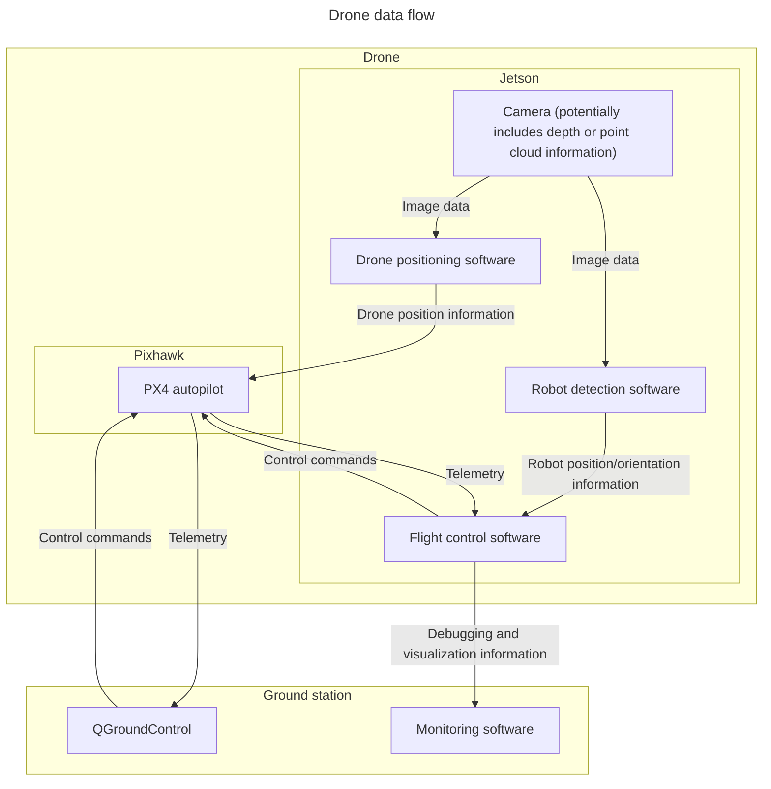
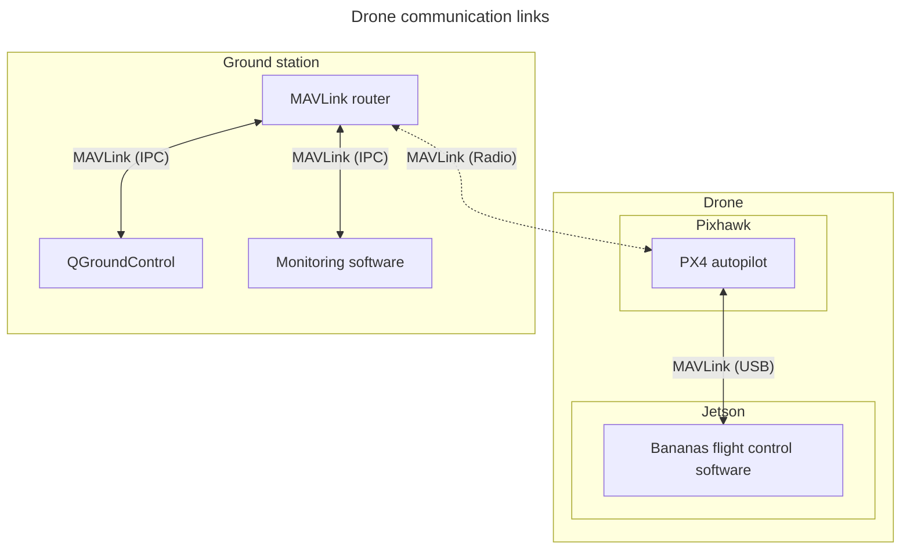
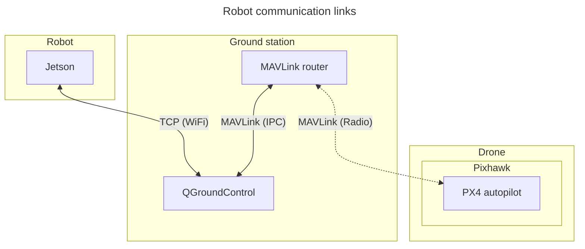

# Planned system architecture

## Drone (Henrik, Pekko, Väinö)

The drone's task is to locate the robot and the boxes using a camera, relocating
itself to locations where it can see them best. The drone will have two
computers onboard: a Pixhawk running the PX4 autopilot and a Jetson Orin Nano
running our control software and reading camera input. The autopilot computer is
required for handling the actual flying, and the onboard computer is required
for directly processing camera images on the drone without having to push them
through a potentially slow remote link. In addition to controlling the drone,
the Jetson gives the autopilot camera-based position information to correct its
knowledge on the drone's position.

To allow monitoring the status of the system and potentially taking manual
control of the flight, the drone will need to communicate with a ground station.
The ground station has at least two pieces of software running:
[QGroundControl](https://qgroundcontrol.com/), a general ground control station
software, and our own system monitoring software. QGroundControl can be used to
check the telemetry information coming from the drone's autopilot and to take
control of the drone when needed. Our own monitoring software handles
visualizing the state of our own systems and provides observability for them: it
shows how the system sees its own state, including the locations of the boxes
and the robot.

### Camera processing (Väinö, Chen)

The camera connected to the Jetson is required for two purposes: finding the
exact location of the drone and finding where our robot is.

Since we are flying indoors, we can't depend on GPS, and hence we need external
position information to keep the drone flying stably and to know how positions
in the images it takes are related to positions in the world coordinate frame.
Since we already have a camera, we can use the camera for this purpose.
Everything in the static environment is in our control: we can modify or
photograph the entire room in advance before adding the boxes, and if our system
is operating correctly, all the locations and orientations of the boxes stacked
this far can be considered static and used for finding our drone's position. The
positioning method our team has made most progress with is placing known
[ArUco](https://docs.opencv.org/4.x/d5/dae/tutorial_aruco_detection.html)
markers to known positions in the environment and detecting them from the camera
images to find where the drone is and how it is oriented.

The second resposibility of the camera handling code is finding where our robot
is. This far, our team has mostly focused on detecting boxes instead of the
robot itself, but box detection methods could potentially be modified for
finding the robot. There are two methods our team has investigated this far:
using a depth camera to produce a point cloud from which boxes are detected, and
placing ArUco markers on the sides of the boxes to detect their locations and
orientations based on the markers. Neither method is without issues: it isn't
always easy to detect boxes from point cloud data, and using ArUco markers on
boxes is kind of cheating because it requires making modifications to them. We
can measure and photograph the boxes as we wish, but their appearance might not
be in our control.

### Data flow

### Communication links

At the time of writing, it seems like we won't be able to fit a WiFi antenna to
the Jetson carried by our drone. Hence, all communication to and from the Jetson
needs to go through the radio connected to the Pixhawk autopilot module. The
radio communication uses the [MAVLink](https://mavlink.io/) protocol supported
by both PX4 and QGroundControl, and custom MAVLink messages can be added for the
functionalities need to allow sending our own messages through the same channel.

## Robot

The robots task is to pick up and stack boxes based on the information/commands received from the drone. The robot has a Jetson Nano as it's onboard computer, arm for picking and placing boxes, and two tracks for moving around. The robot lacks any sensors, besides one or more cameras (mainly for collision avoidance and fine tuning the the arm), thus it relies on the drone giving information, such as its position and the position of the boxes. The robot relies on the open source software Jetbot for basic controls, on top of which we build our own control software.

### Communication

Depending on wether the drone will have WiFi antennas installed, it will either communicate directly with the drone through WiFi/Radio or through the Ground Control Station through Wifi.

