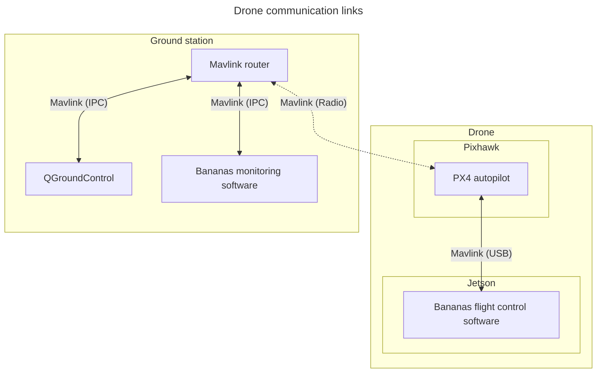
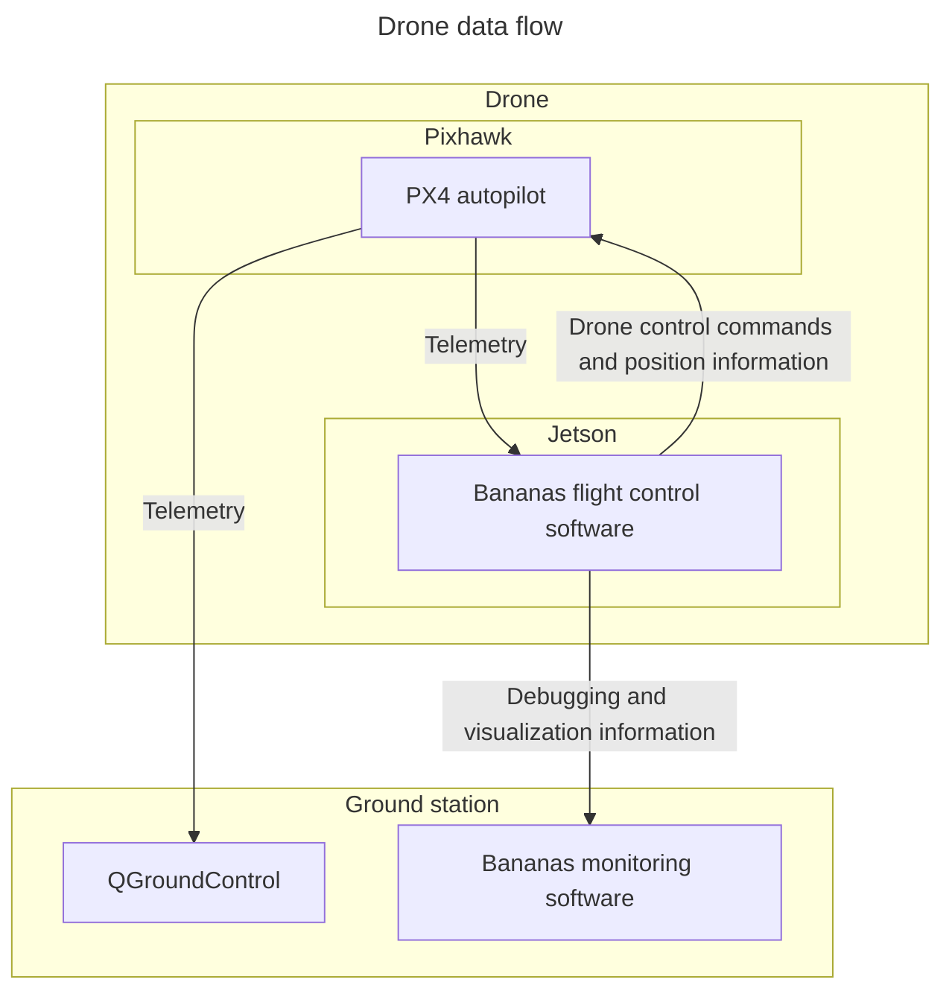

# Planned system architecture

## Drone

The drone's task is to locate the robot and the boxes using a camera, relocating
itself to locations where it can see them best. The drone will have two
computers onboard: a Pixhawk running the PX4 autopilot and a Jetson Orin Nano
running our control software and reading camera input. In addition to
controlling the drone, the Jetson gives the autopilot camera-based position
information to correct its knowledge on the drone's position.

### Communication

At the time of writing, it seems like we won't be able to fit a WiFi antenna to
the Jetson carried by our drone. Hence, all communication to and from the Jetson
needs to go through the radio connected to the Pixhawk autopilot module.

